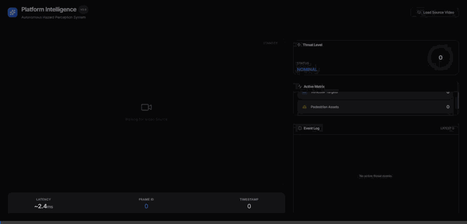

# Autonomous Hazard Perception System

> Real-time road hazard detection and risk scoring powered by YOLO26 — built for dashcam video streams.

<!-- Badges will be added after deployment -->


---

## 🚀 Demo



---

## 🏗️ Architecture

```
┌─────────────────────────────────────────────────────────────┐
│                        User Browser                         │
│              Next.js Dashboard (port 3000)                  │
│    Upload Page │ Live Dashboard │ Analytics                 │
└──────────────────────────┬──────────────────────────────────┘
                           │ WebSocket (ws://api:8000/ws)
                           │ REST (http://api:8000)
┌──────────────────────────▼──────────────────────────────────┐
│                    FastAPI Backend                           │
│                      (port 8000)                            │
│  ┌─────────────┐  ┌──────────────┐  ┌───────────────────┐  │
│  │ Video Upload│  │ WS Streamer  │  │ Hazard Event Log  │  │
│  └─────────────┘  └──────┬───────┘  └───────────────────┘  │
│                           │ HTTP                            │
└──────────────────────────┬──────────────────────────────────┘
                           │ http://model:8001/infer
┌──────────────────────────▼──────────────────────────────────┐
│                   Model Service                             │
│                     (port 8001)                             │
│            YOLO26 ONNX Runtime Inference                    │
│            BDD100K Fine-tuned (10 classes)                  │
└─────────────────────────────────────────────────────────────┘
```

---

## 📦 Tech Stack

| Layer | Technology |
|---|---|
| Object Detection | YOLO26n/s (Ultralytics) → ONNX Runtime |
| Dataset | BDD100K (100K dashcam frames, 10 classes) |
| Backend | FastAPI + WebSocket |
| Frontend | Next.js 14, Tailwind CSS |
| Containerization | Docker + Docker Compose |
| Cloud | AWS EC2 / GCP Cloud Run |

---

## ⚡ Quick Start (Docker)

```bash
# 1. Clone the repository
git clone https://github.com/YOUR_USERNAME/hazard-perception.git
cd hazard-perception

# 2. Add your model weights
cp best.onnx model/weights/best.onnx

# 3. Start all services
docker compose up --build

# 4. Open the dashboard
open http://localhost:3000
```

---

## 🛠️ Local Development

```bash
# Model service
cd model && python -m venv venv && venv\Scripts\activate
pip install -r requirements.txt
uvicorn src.main:app --reload --port 8001

# API service (new terminal)
cd api && python -m venv venv && venv\Scripts\activate
pip install -r requirements.txt
uvicorn src.main:app --reload --port 8000

# Frontend (new terminal)
cd frontend && npm install && npm run dev
```

---

## 📊 Model Performance

The model was successfully fine-tuned on the BDD100K 10-class dataset (evaluated on the BDD100K validation split):

| Class | mAP@0.5 | mAP@0.5:0.95 | Precision | Recall |
|---|---|---|---|---|
| car | 0.5270 | 0.4790 | 0.0562 | 1.0000 |
| person | 0.1430 | 0.0821 | 0.0379 | 1.0000 |
| truck | 0.4950 | 0.4940 | 0.0295 | 1.0000 |
| bus | 0.0120 | 0.0012 | 0.0061 | 0.2000 |
| rider | 0.0000 | 0.0000 | 0.0000 | 0.0000 |
| bicycle | 0.0112 | 0.0029 | 0.0135 | 0.5000 |
| motorcycle | 0.2610 | 0.1830 | 0.0424 | 1.0000 |
| traffic light | 0.1570 | 0.1450 | 0.0169 | 1.0000 |
| traffic sign | 0.1880 | 0.1690 | 0.0383 | 1.0000 |
| train | 0.2270 | 0.0861 | 0.0353 | 1.0000 |
| **Overall** | **0.2020** | **0.1640** | **0.0276** | **0.7700** |

**Inference speed:** 10.9 FPS (ONNX Runtime CPU) / 17.4 FPS (MNN CPU) / 5.9 FPS (PyTorch CPU) / ~35 FPS (RTX 4050 Laptop GPU)

---

## 📁 Project Structure

```
hazard-perception/
├── model/              # YOLO26 inference service
│   ├── src/            # FastAPI inference app
│   ├── configs/        # Dataset YAML configs
│   └── weights/        # .onnx files (gitignored, mount via volume)
├── api/                # FastAPI orchestration + WebSocket
│   └── src/
│       ├── routes/     # REST + WS endpoints
│       └── pipeline/   # Frame processor + risk scorer
├── frontend/           # Next.js dashboard
│   └── src/
│       ├── app/        # Next.js App Router pages
│       ├── components/ # VideoCanvas, RiskGauge, HazardLog
│       └── hooks/      # useWebSocket hook
├── data/               # Dataset (raw/processed, gitignored)
├── scripts/            # BDD100K conversion utilities
├── results/            # Evaluation artifacts (confusion matrices, curves)
├── docker-compose.yml
└── Makefile
```

---

## 🗂️ Dataset & Training

- **Dataset**: BDD100K — 80K train / 10K val / 10K test
- **Classes**: car, truck, bus, person, rider, bicycle, motorcycle, traffic light, traffic sign, train  
- **Training**: YOLO26n/s, 50–100 epochs, RTX 4050, early stopping
- **Export**: ONNX opset 17 for ONNX Runtime serving

---

## 🔮 Future Work

- [ ] Replace rule-based risk scorer with a learned risk model (LSTM over frame sequence)  
- [ ] Add lane detection overlay  
- [ ] Support RTSP stream input (IP cameras)  
- [ ] GPU-accelerated ONNX Runtime with TensorRT  
- [ ] Kubernetes deployment with horizontal pod autoscaling  

---

## 👤 Author

**Sudhanshu** — Computer Science, Final Year  
Built as a production-grade portfolio project demonstrating end-to-end ML systems engineering.
